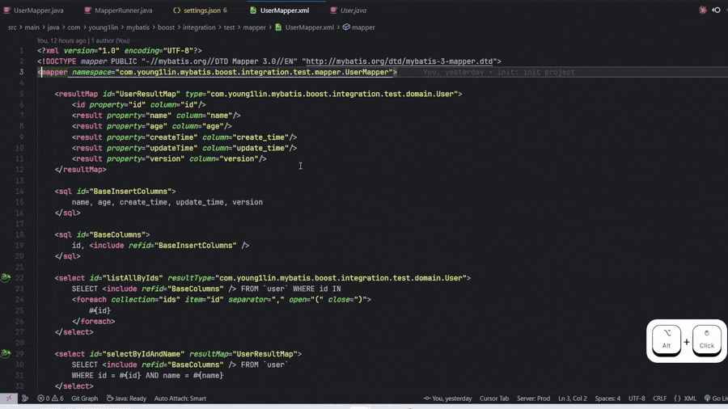

# MyBatis Boost

[English](README.md) | 简体中文

MyBatis 映射器接口（Java）与 XML 映射文件之间的高性能双向导航 VS Code 扩展。提供 10 种跳转到定义的导航方式、实时参数验证、可视化绑定指示器和灵活的导航模式。通过 LRU 缓存、文件监视器和优化解析，实现低于 100 毫秒的导航延迟。


## 功能特性

### 🎯 MyBatis 代码生成器

通过交互式 WebView 面板，从 DDL SQL 语句生成完整的 MyBatis 样板代码。

**生成内容：**
- **实体类**（POJOs），支持可配置的 Lombok 和 Swagger 注解
- **Mapper 接口**，包含 CRUD 方法
- **XML 映射文件**，包含完整的 SQL 语句（insert、update、delete、select）
- **Service 类**，包含常用业务逻辑

**支持的数据库：**
- MySQL（AUTO_INCREMENT、ENGINE、COMMENT 语法）
- PostgreSQL（SERIAL、BIGSERIAL、COMMENT ON 语法）
- Oracle（VARCHAR2、NUMBER、CLOB、COMMENT ON 语法）

**配置选项**（`mybatis-boost.generator.*`）：
- `basePackage`：生成代码的基础包名（例如：`com.example.mybatis`）
- `author`：代码注释中的作者名称（默认：`MyBatis Boost`）
- `entitySuffix`：实体类后缀（默认：`PO`）
- `mapperSuffix`：Mapper 接口后缀（默认：`Mapper`）
- `serviceSuffix`：Service 类后缀（默认：`Service`）
- `datetime`：日期时间类型映射 - `Date` | `LocalDateTime` | `Instant`（默认：`Date`）
- `useLombok`：启用 Lombok 注解 `@Data`、`@Getter`、`@Setter`（默认：`true`）
- `useSwagger`：启用 Swagger 2 注解 `@ApiModel`、`@ApiModelProperty`（默认：`false`）
- `useSwaggerV3`：启用 Swagger 3 (OpenAPI) 注解（默认：`false`）

**功能特性：**
- **导出前预览**：在 WebView 面板中查看所有生成的代码
- **一键导出**：自动创建正确的目录结构
- **生成历史**：跟踪所有生成的代码，包含 SQL 和文件预览
- **智能类型映射**：将 SQL 类型转换为适当的 Java 类型（例如：`BIGINT` → `Long`、`VARCHAR` → `String`）
- **注释保留**：从 DDL 中提取表和列注释到 Javadoc
- **灵活输出**：根据项目需要选择是否使用 Lombok/Swagger

**使用示例：**
```sql
CREATE TABLE user_info (
    id BIGINT PRIMARY KEY AUTO_INCREMENT COMMENT '用户 ID',
    username VARCHAR(50) NOT NULL COMMENT '用户名',
    email VARCHAR(100) COMMENT '邮箱地址',
    created_at DATETIME COMMENT '创建时间'
) ENGINE=InnoDB COMMENT='用户信息表';
```

这将生成：
- `UserInfoPO.java` - 实体类，带 Lombok `@Data` 注解
- `UserInfoMapper.java` - Mapper 接口，包含 CRUD 方法
- `UserInfoMapper.xml` - XML 文件，包含 insert/update/delete/select 语句
- `UserInfoService.java` - Service 类，包含常用操作

**AI 集成（Cursor IDE / VS Code Copilot）：**

MyBatis Boost 提供**模型上下文协议（MCP）**支持，用于 AI 驱动的代码生成：

- **自动 IDE 检测**：与 VS Code Copilot 和 Cursor IDE 无缝协作
- **四个 MCP 工具**可供 AI 助手使用：
  1. `mybatis_parse_sql_and_generate` - 解析 DDL 并生成代码（仅预览）
  2. `mybatis_export_generated_files` - 将生成的文件导出到文件系统
  3. `mybatis_query_generation_history` - 查询过去的生成记录
  4. `mybatis_parse_and_export` - 组合的解析和导出操作
- **配置**：使用 `mybatis-boost.mcp.enable` 启用/禁用（默认：`true`）
- **动态更新**：更改立即生效，无需重启

对于 Cursor IDE 用户，扩展会自动注册一个 stdio MCP 服务器，用于 AI 工具集成。

### 🚀 10 种跳转到定义的导航方式

**Java ↔ XML 双向导航：**
- **F12 或 Ctrl+点击** Java **接口名称** → XML `<mapper>` 标签
- **F12 或 Ctrl+点击** Java **方法名称** → XML SQL 语句
- **F12 或 Ctrl+点击** XML **namespace** 属性 → Java 接口
- **F12 或 Ctrl+点击** XML **语句 ID**（例如 `id="findById"`）→ Java 方法

**XML SQL 片段引用：**
- **F12 或 Ctrl+点击** `<include refid="xxx">` → `<sql id="xxx">` 定义
- **F12 或 Ctrl+点击** `<sql id="xxx">` → 显示所有 `<include>` 引用

**Java 类引用：**
- **F12 或 Ctrl+点击** XML 属性中的 Java 类名 → 类定义
- 支持 `resultType`、`parameterType`、`type`、`ofType`、`javaType`

**ResultMap 导航：**
- **F12 或 Ctrl+点击** `<result property="fieldName">` → Java 类字段定义
- **F12 或 Ctrl+点击** `resultMap="xxx"` → `<resultMap id="xxx">` 定义
- **F12 或 Ctrl+点击** `<resultMap id="xxx">` → 显示所有对此 resultMap 的引用

**参数导航：**
- **F12 或 Ctrl+点击** `#{paramName}` 或 `${paramName}` → Java 字段或 @Param 注解
- 支持导航到 `parameterType` 类字段
- 支持导航到带有 `@Param` 注解的方法参数
- 适用于 `<select>`、`<insert>`、`<update>`、`<delete>` 语句

**智能特性：**
- **两种导航模式**：CodeLens（默认，非侵入式）或 DefinitionProvider（可选，F12）
- 基于内容的 MyBatis 映射器检测（通过 `@Mapper` 注解或 MyBatis 导入）
- 智能 XML 文件匹配，采用 5 层优先级策略

### 💾 智能缓存

- **LRU 缓存**，可配置大小（默认：5000 条目）
- **自动缓存失效**，文件更改时触发
- **增量更新**，通过文件系统监视器
- **批量更新处理**，优化性能

### 🎨 可视化绑定指示器

- **装订线图标**，显示在绑定在一起的 Java 方法和 XML 语句旁边
- 快速可视化反馈，显示哪些方法有对应的 XML 语句
- 文件更改时自动更新
- 可通过设置切换：`mybatis-boost.showBindingIcons`

### ✅ 实时参数验证

- **自动验证** XML 中的 `#{paramName}` 和 `${paramName}` 引用
- **红色下划线**显示未定义的参数，并提供有用的错误消息
- 验证依据：
  - `parameterType` 类中的字段
  - 带有 `@Param` 注解的方法参数
  - 动态 SQL 标签（`foreach`、`bind`）中的局部变量
  - 处理嵌套属性（例如，`#{user.name}` 验证基础对象 `user`）
- 适用于 `<select>`、`<insert>`、`<update>`、`<delete>` 语句
- 帮助在运行时之前捕获拼写错误和缺失参数

**示例：**
```xml
<update id="updateById" parameterType="com.example.Role">
    UPDATE role
    SET role_name = #{roleName},  <!-- ✅ 有效：Role 有此字段 -->
        invalid = #{wrongField}    <!-- ❌ 错误：Role 没有此字段 -->
    WHERE id = #{id}
</update>
```

### 🔍 SQL 组合与悬停预览

- **在 XML 语句 ID 上悬停**：鼠标悬停在 statement 的 `id` 属性值上时，查看完整拼接后的 SQL
- **在 Java 映射器方法上悬停**：鼠标悬停在方法名上时，查看对应的完整 SQL
- **自动解析 `<include>`**：递归解析所有 `<include refid="xxx">` 引用
- **支持嵌套 include**：处理 SQL 片段中包含其他 include 的情况
- **循环引用检测**：防止无限循环，并显示有用的错误消息
- **缺失片段处理**：显示清晰的 "Fragment not found" 消息
- **所有语句类型**：支持 `<select>`、`<insert>`、`<update>`、`<delete>`
- **保留动态 SQL**：保留 MyBatis 标签（`<if>`、`<where>`、`<trim>` 等）以提供上下文
- **非侵入式 UI**：使用悬停提示，无 CodeLens 或装饰器
- **实时组合**：按需组合 SQL，无性能影响

**示例：**
```xml
<sql id="Base_Column_List">
    id, account_cfg_id, symbol_cfg_id, profit
</sql>

<sql id="where_condition">
    <trim prefix="WHERE" prefixOverrides="AND | OR">
        <if test="accountCfgId != null">
            AND t.account_cfg_id = #{accountCfgId}
        </if>
    </trim>
</sql>

<select id="selectByCondition" resultMap="BaseResultMap">
    <!-- 鼠标悬停在 "selectByCondition" 上查看完整 SQL -->
    select
    <include refid="Base_Column_List"/>
    from t_bo_account_symbol_cfg t
    <include refid="where_condition"/>
</select>
```

**在 Java 映射器中：**
```java
// 鼠标悬停在方法名上查看完整拼接后的 SQL
List<AccountSymbolCfg> selectByCondition(AccountSymbolCfgQuery query);
```

### 🔄 灵活的导航模式

根据您的工作流程在两种导航模式之间选择：

**CodeLens 模式（默认 - 推荐）**
- 非侵入式：保留原生 Java 定义行为
- 在 Java 类上按 F12 仍然跳转到类定义
- 在接口和方法上方显示可点击的 "jumpToXml" 链接
- 对于带有 SQL 注解的方法自动隐藏

**DefinitionProvider 模式（可选）**
- 在 Java 方法上按 F12 直接跳转到 XML 语句
- 更直接但会覆盖原生 Java 导航
- 通过 `mybatis-boost.useDefinitionProvider: true` 启用
- 更改立即生效

## 安装

### 前置要求

**包管理器版本管理**

本项目使用 **Corepack** 来固定 pnpm 版本，确保所有环境使用一致的包管理器版本（类似 Python 的 `uv`）。

**首次设置（仅需一次）：**
```bash
# 启用 Corepack（Node.js 16.9+ 内置）
corepack enable
```

启用 Corepack 后，它会自动：
- 检测 `package.json` 中的 `packageManager` 字段
- 下载并缓存指定的 pnpm 版本（10.19.0）
- 对所有 `pnpm` 命令透明地使用正确的版本

**优势：**
- ✅ 保证所有团队成员使用相同的 pnpm 版本
- ✅ 在新环境中自动下载正确的版本
- ✅ 防止因版本不匹配导致的"在我机器上能运行"问题
- ✅ 无需手动安装特定的 pnpm 版本

**兼容性：**
- Node.js 16.9+（默认包含 Corepack）
- 可在 CI/CD 环境中使用
- 支持 pnpm、yarn 和 npm 版本固定

### 构建和运行

1. 克隆此仓库
2. 启用 Corepack（仅首次需要）：
   ```bash
   corepack enable
   ```
3. 安装依赖：
   ```bash
   pnpm install
   ```
4. 构建扩展：
   ```bash
   pnpm run compile
   ```
5. 按 F5 启动扩展开发主机

## 使用方法

### 跳转到定义导航

**1. Java 接口 → XML 映射器：**
```java
public interface UserMapper {  // ← 在 "UserMapper" 上 Ctrl+点击跳转到 XML <mapper> 标签
    User findById(Long id);
}
```

**2. Java 方法 → XML 语句：**
```java
public interface UserMapper {
    User findById(Long id);  // ← 在 "findById" 上 Ctrl+点击跳转到 XML <select id="findById">
}
```

**3. XML 命名空间 → Java 接口：**
```xml
<mapper namespace="com.example.mapper.UserMapper">
  <!--              ^^^^^^^^^^^^^^^^^^^^^^^^^^^^^^^ Ctrl+点击跳转到 Java 接口 -->
</mapper>
```

**4. XML 语句 ID → Java 方法：**
```xml
<select id="findById" resultType="com.example.User">
  <!--      ^^^^^^^^ 在 id 值上 Ctrl+点击跳转到 Java 方法 -->
  SELECT * FROM users WHERE id = #{id}
  <!--    ⚠️ 注意：仅当光标在 "findById" 上时导航才有效，SQL 内容上无效 -->
</select>
```

**5. Java 类引用：**
```xml
<select id="findUser" resultType="com.example.User">
  <!--                            ^^^^^^^^^^^^^^^^ Ctrl+点击跳转到 User 类定义 -->
  SELECT * FROM users WHERE id = #{id}
</select>
```

**6. SQL 片段引用（同一 XML 内）：**
```xml
<!-- 定义可重用的 SQL 片段 -->
<sql id="Base_Column_List">
  <!--  ^^^^^^^^^^^^^^^^^ Ctrl+点击显示对此片段的所有引用 -->
  id, name, email, created_at, updated_at
</sql>

<!-- 使用 SQL 片段 -->
<select id="findById" resultType="com.example.User">
  SELECT <include refid="Base_Column_List" /> FROM users WHERE id = #{id}
    <!--             ^^^^^^^^^^^^^^^^^ Ctrl+点击跳转到 sql 片段定义 -->
</select>
```

**7. ResultMap 属性导航（新功能）：**
```xml
<resultMap id="UserResultMap" type="com.example.User">
  <result property="userId" column="user_id"/>
    <!--            ^^^^^^ Ctrl+点击跳转到 User 类中的 userId 字段 -->
  <result property="userName" column="user_name"/>
</resultMap>
```

**8. ResultMap 引用导航（新功能）：**
```xml
<!-- 定义 resultMap -->
<resultMap id="UserResultMap" type="com.example.User">
  <!--         ^^^^^^^^^^^^^ Ctrl+点击显示对此 resultMap 的所有引用 -->
  <id property="id" column="id"/>
  <result property="userName" column="user_name"/>
</resultMap>

<!-- 使用 resultMap -->
<select id="findAll" resultMap="UserResultMap">
  <!--                          ^^^^^^^^^^^^^ Ctrl+点击跳转到 resultMap 定义 -->
  SELECT * FROM users
</select>
```

### 命令

| 命令 | 描述 |
|------|------|
| MyBatis Boost: 清除缓存并重建 | 清除所有缓存的映射并重建 |
| MyBatis Boost: 刷新映射 | 刷新映射并显示进度指示器 |

## 配置

打开 VS Code 设置并搜索 "MyBatis Boost"：

| 设置 | 类型 | 默认值 | 描述 |
|------|------|--------|------|
| `mybatis-boost.cacheSize` | number | 5000 | 要缓存的映射器对的最大数量 |
| `mybatis-boost.customXmlDirectories` | array | [] | 用于搜索 XML 文件的自定义目录（匹配策略中的优先级 1） |
| `mybatis-boost.javaParseLines` | number | 100 | 用于命名空间提取的读取行数 |
| `mybatis-boost.showBindingIcons` | boolean | true | 在 Java 方法和 XML 语句之间显示 MyBatis 绑定的装订线图标 |
| `mybatis-boost.useDefinitionProvider` | boolean | false | 启用 Java 到 XML 导航的 DefinitionProvider 模式（为 false 时使用 CodeLens 模式） |

## 架构

### 缓存系统

- **LRU 内存缓存**：最近使用的映射保存在内存中（默认：5000 条目）
- **自动缓存失效**：通过文件系统监视器在文件更改时触发
- **修改时间戳跟踪**：用于缓存验证

### 文件映射策略（5 层优先级）

扩展使用智能的 5 层策略来查找 Java 映射器的 XML 文件：

1. **优先级 0 - 快速路径**：常见结构（同一目录、`mapper/` 子目录、镜像 `resources/` 路径）
2. **优先级 1 - 自定义目录**：通过 `mybatis-boost.customXmlDirectories` 用户配置
3. **优先级 2 - 常见模式**：`/mapper/`、`/mappers/`、`/xml/`、`/dao/`、`/mybatis/`
4. **优先级 3 - 基于包**：将 Java 包转换为路径（例如，`com.example.UserMapper` → `**/com/example/UserMapper.xml`）
5. **优先级 4 - 完全扫描**：所有剩余的 XML 文件，并进行命名空间验证

### MyBatis 映射器检测

基于内容的检测（不仅仅是文件名模式）：
- 必须是 Java `interface`
- 必须包含 MyBatis 注解（`@Mapper`、`@Select`、`@Insert`、`@Update`、`@Delete`）
- 或包含 MyBatis 导入（`org.apache.ibatis.*`、`org.mybatis.*`）

## 开发

### 构建

```bash
# 开发构建
pnpm run compile

# 监视模式
pnpm run watch

# 生产构建
pnpm run package
```

### 测试

```bash
# 运行所有测试
pnpm test

# 监视测试
pnpm run watch-tests

# 类型检查
pnpm run check-types

# 代码检查
pnpm run lint
```

## 故障排除

### 导航不工作

1. 确保 Java 文件有 MyBatis 注解（`@Mapper`）或导入（`org.apache.ibatis.*`）
2. 检查 XML 文件是否有匹配的 `namespace` 属性
3. 尝试清除缓存："MyBatis Boost: 清除缓存并重建"

### 自定义 XML 目录不工作

1. 确保路径相对于工作区根目录
2. 检查 XML 文件是否有正确的 `namespace` 属性
3. 配置示例：
   ```json
   {
     "mybatis-boost.customXmlDirectories": [
       "src/main/resources/mybatis/mappers",
       "config/xml"
     ]
   }
   ```

### 映射未更新

1. 文件监视器可能在大型工作区中被禁用
2. 手动刷新："MyBatis Boost: 刷新映射"
3. 检查 VS Code 文件监视器限制：`files.watcherExclude`

### 绑定图标未显示

1. 确保 `mybatis-boost.showBindingIcons` 设置为 `true`
2. 检查 Java 方法名称是否与 XML 语句 ID 完全匹配
3. 尝试重新打开文件或刷新映射

### CodeLens 未显示

1. 确保 `mybatis-boost.useDefinitionProvider` 设置为 `false`（默认）
2. 检查 Java 文件是否有对应的 XML 映射器
3. 验证 Java 接口是否有 `@Mapper` 注解或 MyBatis 导入
4. CodeLens 对于带有 SQL 注解（`@Select` 等）的方法自动隐藏

### 参数验证不工作

1. 确保 XML 文件有有效的 `namespace` 属性
2. 检查语句是否有匹配的 Java 方法
3. 验证 `parameterType` 属性是否为有效的完全限定类名
4. 对于嵌套属性，确保基础对象存在（例如，对于 `#{user.name}`，验证 `user` 存在）

### 扩展未激活

1. 确保工作区包含 Java 项目：
   - `pom.xml`（Maven）
   - `build.gradle` 或 `build.gradle.kts`（Gradle）
   - `src/main/java/` 目录
2. 检查 VS Code 输出面板的错误
3. 重启 VS Code

## 系统要求

- VS Code 1.99.3 或更高版本
- 带有 MyBatis 映射器的 Java 项目
- Node.js 22.x 或更高版本（用于开发）

## 国际化

扩展支持多种语言：

- **English**（英语 - 默认）
- **简体中文**（Simplified Chinese）

扩展会自动使用您的 VS Code 显示语言。要更改语言：

1. 打开命令面板（Ctrl+Shift+P / Cmd+Shift+P）
2. 输入 "Configure Display Language"（配置显示语言）
3. 选择您的首选语言
4. 重启 VS Code

更多详情，请参阅 [docs/i18n.md](docs/i18n.md)。

## 贡献

欢迎贡献！请确保：

1. 所有测试通过：`pnpm test`
2. 代码已检查：`pnpm run lint`
3. 达到性能目标（P50 < 100ms，P95 < 200ms）
4. 在 CLAUDE.md 中记录更改

## 许可证

MIT

## 更新日志

详细的版本历史记录请参阅 [CHANGELOG.md](CHANGELOG.md) 或 [CHANGELOG.zh-cn.md](CHANGELOG.zh-cn.md)。
